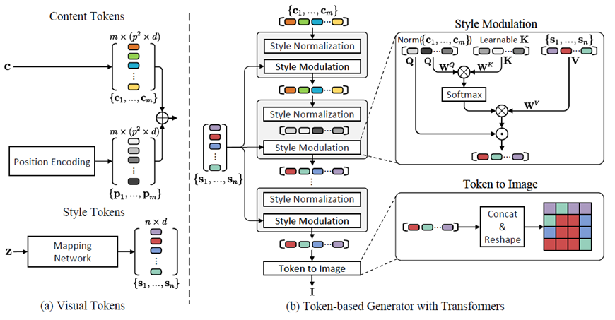
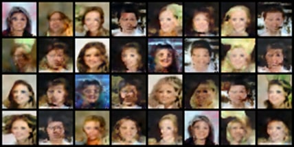
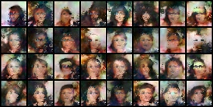

# Token GAN

Based on [Annotated Style GAN 2](https://github.com/labmlai/annotated_deep_learning_paper_implementations) and 
[Token GAN](https://openreview.net/forum?id=lGoKo9WS2A_)

Please note that I am NOT the author of the above works. 
I just like the idea of the Token GAN, but the implementation of 
the Style GAN 2 (on which Token GAN is based) is way too complicated.
So I decided to rewrite it using Annotated Style GAN 2 as a foundation.

TensorBoard logs and trained model (70 000 iterations) can be 
found in the [releases](https://github.com/IronTony-Stark/StyleTransGAN/releases/tag/v0.1.0)

[Kaggle Notebook](https://www.kaggle.com/code/irontony/styletransgan/edit) in case you want to train the model yourself.

Below are images generated at 58 000 and 100 500 iterations. 
Transformers are really data hungry, so for better quality images
further training is required.

